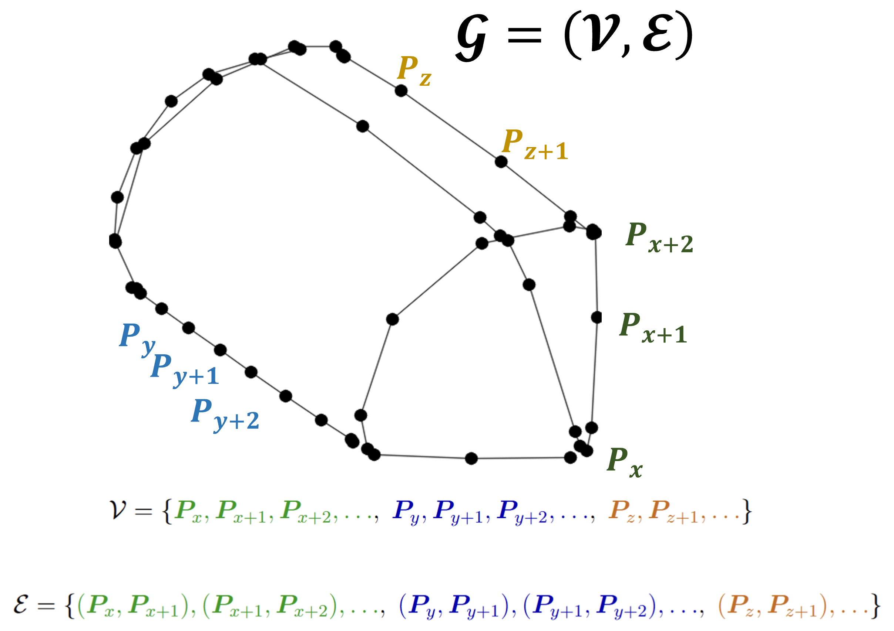
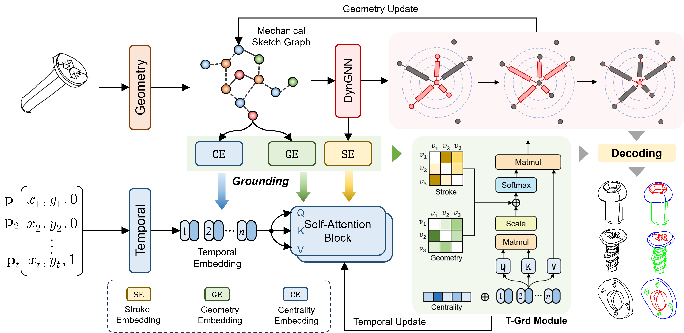
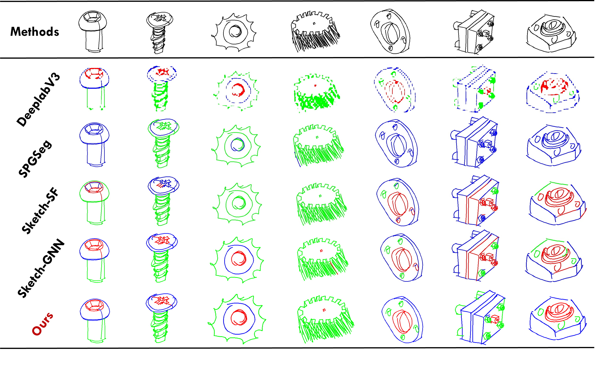

# CADSketch-Seg

Point-wise segmentation of CAD-style vector sketches. The input is a
stroke-based vector drawing (x/y samples grouped into strokes); the output is
a segment label for every point (e.g. for a gear: teeth / body / shaft).

> **Status.** The paper describing this work has been submitted to **Pattern
> Recognition Letters** as SketchMeSeg: Mechanical Freehand Sketch Segmentation via
Temporal-Driven Geometric Grounding. This repository currently provides a small sample of
> the mechanical-sketch data and the core implementation. The final version of
> the data and code will be released once the paper is accepted.

## Method





The model has two parallel branches built on the same point sequence:

* **Geometric branch** -- 4 stacked DynGCN blocks (dynamic kNN graph
  convolution, k = 8) that read the raw geometry. Their outputs are
  concatenated into a 128-d feature `F_geo`.
* **Sequence branch** -- a 1-layer Bi-GRU (hidden 32, output 64) followed by 4
  Transformer encoder layers (d_model = 64, 4 heads, FFN width 192, dropout
  0.1). The self-attention is biased by the T-Grd encoding: centrality
  embeddings, a geometric bias `b_ij` learned from local curvature and
  shortest-path distance, and a stroke bias `c_ij` aggregated over path edges.

The branch features are concatenated (128 + 64), fused by an MLP into 256
dims, pooled per stroke, classified, and the stroke logits are broadcast back
to the points. The loss is a per-point (log) cross-entropy, so the network can
also serve in a stroke-only setting.

Implementation: `netV3.py`, shared blocks in `modules/`.

## Data

The repository ships two kinds of sample data:

* `Dataset/MC-example/` -- mechanical sketch classes (gear, screw) with
  per-point labels, in NDJSON. Each line of an `.ndjson` file is one sketch:

  ```json
  {"drawing": [[xs, ys, labels], [xs, ys, labels], ...]}
  ```

  Each inner list is one stroke; `labels` holds the segment id of every point.
  Coordinates are normalized to [0, 1] per sketch and the sketches are already
  resampled to 512 points.

* `Dataset/nut/` -- raw mechanical sketches (e.g. T-nut, hex nut, YMJ hydraulic
  nut) saved as `.npy` arrays.

Both folders only contain a partial sample; the full dataset will be released
with the final version.

## Setup

Python 3.8+, PyTorch, PyTorch Geometric, torch-scatter, torch-cluster.

```bash
pip install torch torch-scatter torch-sparse torch-cluster torch-geometric
```

`dataset.py` uses plain `torch_geometric.data.Data` and works with current pyg
releases.

## Train

```bash
python train.py --data-folder Dataset --dataset MC-example --class-name gear
```

Hyper-parameters live in `options.py` (defaults: 100 epochs, Adam lr 0.01,
weight decay 5e-4, cosine annealing down to 1e-5). An evaluation is run after
every epoch.

## Evaluation

Two metrics are reported on the test set:

* **P** -- point accuracy weighted by segment length;
* **C** -- stroke-level accuracy, where a stroke counts as correct if more
  than 75% of its length-weighted points agree with the ground truth.

## Results

Table 1. Quantitative comparison on the Mechanical Sketch dataset. Eight
representative categories are shown for clarity; the average is computed over
all classes in the full dataset. Best results in **bold**.

| Category | DeepLabV3 | | SPGSeg | | Sketch-SF | | SketchGNN | | Ours | |
|---|---|---|---|---|---|---|---|---|---|---|
| | **P** | **C** | **P** | **C** | **P** | **C** | **P** | **C** | **P** | **C** |
| Gear | 71.25 | 68.40 | 73.13 | 71.25 | 83.84 | 79.35 | 85.29 | 80.45 | **87.73** | **81.99** |
| Screw | 74.30 | 70.15 | 79.36 | 74.45 | 84.71 | 80.29 | 88.28 | 83.32 | **92.37** | **87.08** |
| Nut | 80.45 | 76.20 | 83.82 | 79.05 | 92.13 | 84.90 | 94.33 | 90.08 | **93.61** | **88.52** |
| Flange | 76.80 | 72.35 | 80.01 | 75.74 | 87.67 | 83.91 | 88.93 | 85.38 | **90.25** | **86.90** |
| Bolt | 73.50 | 69.80 | 77.49 | 72.07 | 86.91 | 80.82 | 87.59 | 80.27 | **87.18** | **82.09** |
| Bearing | 82.10 | 78.45 | 85.80 | 75.30 | 94.20 | 90.30 | 92.86 | 87.73 | **93.63** | **89.51** |
| Knob | 78.90 | 74.60 | 82.90 | 70.90 | 85.30 | 75.20 | 80.70 | 66.20 | **95.98** | **91.56** |
| Chain | 64.20 | 58.30 | 69.03 | 64.32 | 72.50 | 54.20 | 80.70 | 68.10 | **85.80** | **75.30** |
| Avg. | 77.78 | 71.90 | 78.78 | 74.51 | 87.05 | 81.85 | 88.84 | 83.90 | **90.49** | **86.04** |



## Licence

All rights reserved. The code is made available for academic use. The final
release will accompany the accepted paper.